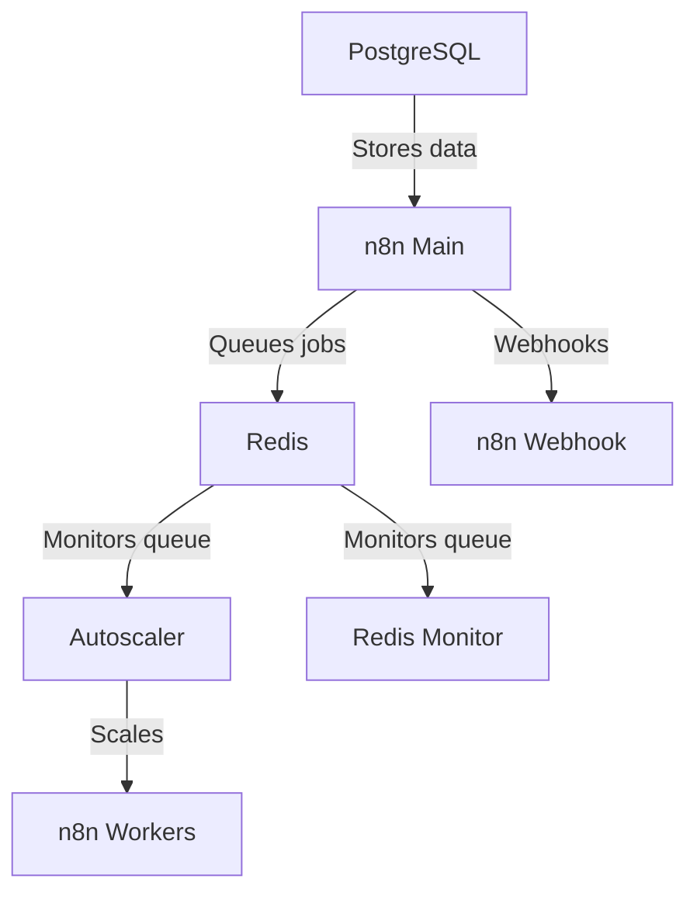

# n8n Autoscaling System

A Docker-based autoscaling solution for n8n workflow automation platform. Dynamically scales worker containers based on Redis queue length.

Includes Puppeteer and Chrome built-in.  

## Architecture Overview



## Features

- Dynamic scaling of n8n worker containers based on queue length
- Configurable scaling thresholds and limits
- Redis queue monitoring
- Docker Compose-based deployment
- Health checks for all services

## Prerequisites

- Docker and Docker Compose

## Quick Start

1. Clone this repository to a folder of your choice
2. Configure your environment variables
3. Run:
   ```bash
   docker-compose up -d
   ```

## Configuration

- Make sure you set your own passwords and encryption keys in the .env file!!!
- By default each worker handles 10 tasks at a time, you can modify this in the docker-compose under:      
      - N8N_CONCURRENCY_PRODUCTION_LIMIT=10
- Adjust these to be greater than your longest expected workflow execution time measured in seconds:
      - N8N_QUEUE_BULL_GRACEFULSHUTDOWNTIMEOUT=300
      - N8N_GRACEFUL_SHUTDOWN_TIMEOUT=300

### Key Environment Variables

| Variable | Description | Default |
|----------|-------------|---------|
| `MIN_REPLICAS` | Minimum number of worker containers | 1 |
| `MAX_REPLICAS` | Maximum number of worker containers | 5 |
| `SCALE_UP_QUEUE_THRESHOLD` | Queue length to trigger scale up | 5 |
| `SCALE_DOWN_QUEUE_THRESHOLD` | Queue length to trigger scale down | 2 |
| `POLLING_INTERVAL_SECONDS` | How often to check queue length | 30 |
| `COOLDOWN_PERIOD_SECONDS` | Time between scaling actions | 180 |
| `QUEUE_NAME_PREFIX` | Redis queue prefix | `bull` |
| `QUEUE_NAME` | Redis queue name | `jobs` |

### n8n Configuration

Ensure these n8n environment variables are set:
- `EXECUTIONS_MODE=queue`
- `QUEUE_BULL_REDIS_HOST=redis`
- `QUEUE_HEALTH_CHECK_ACTIVE=true`

## Scaling Behavior

The autoscaler:
1. Monitors Redis queue length every `POLLING_INTERVAL_SECONDS`
2. Scales up when:
   - Queue length > `SCALE_UP_QUEUE_THRESHOLD`
   - Current replicas < `MAX_REPLICAS`
3. Scales down when:
   - Queue length < `SCALE_DOWN_QUEUE_THRESHOLD`
   - Current replicas > `MIN_REPLICAS`
4. Respects cooldown period between scaling actions

## Monitoring

The system includes:
- Redis queue monitor service (`redis-monitor`)
- Docker health checks for all services
- Detailed logging from autoscaler

## Troubleshooting

- Check container logs: `docker-compose logs [service]`
- Verify Redis connection: `docker-compose exec redis redis-cli ping`
- Check queue length manually: `docker-compose exec redis redis-cli LLEN bull:jobs:wait`

## License

MIT License - See [LICENSE](LICENSE) for details.
